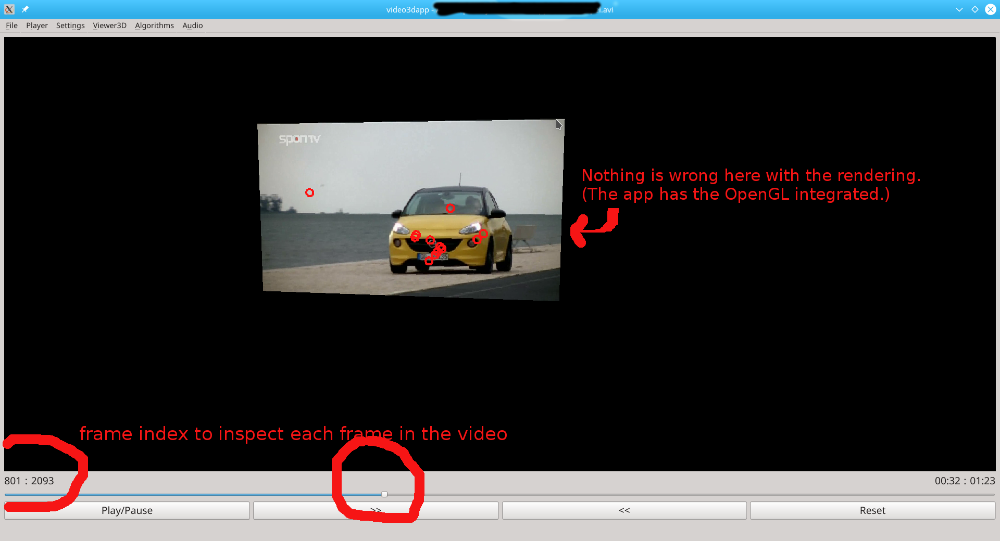

# (VideoEngine) viden -- A very small video engine library 
A very small video processing library to handle a separate video/image processing and GUI in separated threads. It integrates OpenCV (to render the image/video) and Qt for GUI. Its main purposes are to allow user to easily extend the GUI  and to repalce OpenCV HighGui in rendering a video in OpenCV which causes a lagging in debug mode.

# Requirements:
* Qt5
* OpenCV2

# Example of an application build on top of "viden"

